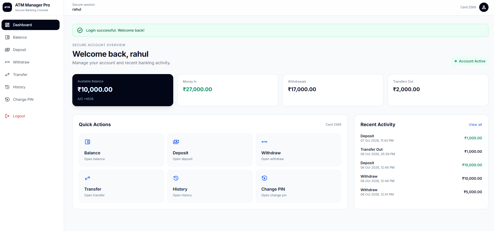
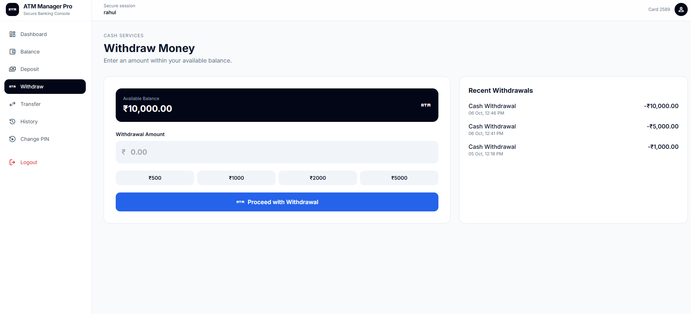
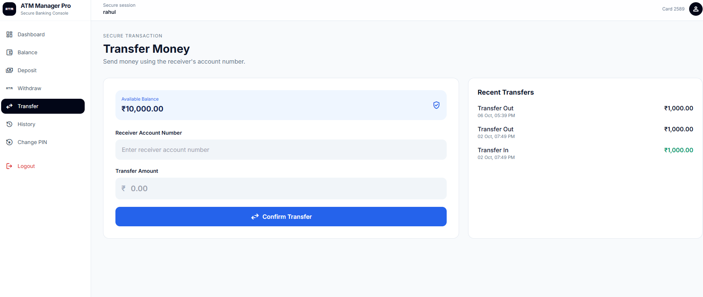
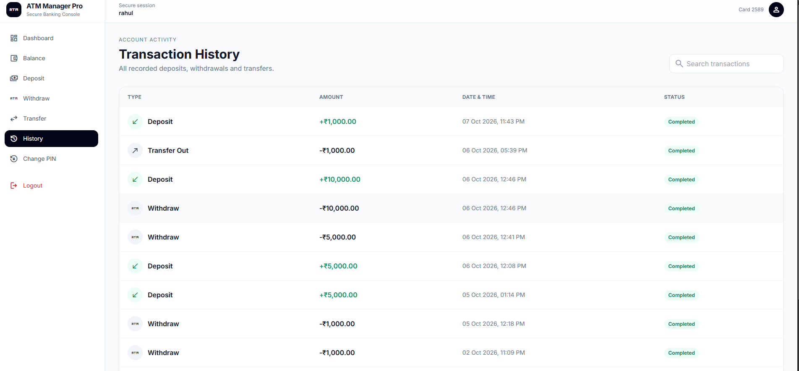
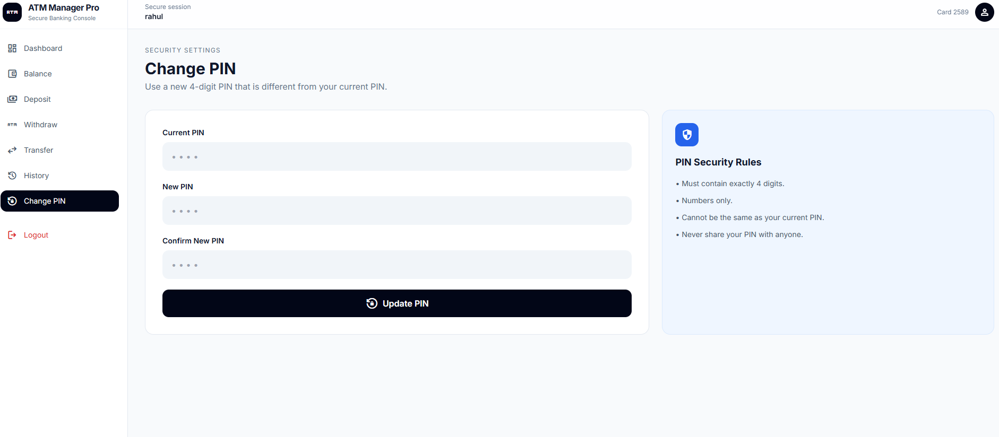

# 🏦 ATM Manager Pro

<p align="center">
    
</p>

<p align="center">
A secure ATM Management System built using Flask, MySQL, HTML, CSS, and JavaScript.
</p>

---

## 🚀 Features

✅ Login Authentication

✅ Session Management

✅ User Dashboard

✅ Balance Inquiry

✅ Deposit Money

✅ Withdraw Money

✅ Transfer Money

✅ Transaction History

✅ Change PIN

✅ User Profile

✅ MySQL Database Integration

✅ Secure Environment Variables (.env)

---

## 📸 Screenshots

### 🔐 Login Page

<p align="center">
    
</p>

---

### 📊 Dashboard

<p align="center">
    
</p>

---

### 💸 Withdraw Money

<p align="center">
    
</p>

---

### 🔄 Transfer Money

<p align="center">
    
</p>

---

### 📜 Transaction History

<p align="center">
    
</p>

---

### 🔑 Change PIN

<p align="center">
    
</p>

---

### 👤 User Profile


---

## 🛠 Tech Stack

### Frontend
- HTML5
- CSS3
- JavaScript

### Backend
- Python
- Flask

### Database
- MySQL

### Version Control
- Git
- GitHub

---

## 📂 Project Structure

```text
ATM_Manager/
│
├── database/
│   ├── models/
│   ├── services/
│   ├── db.py
│   └── table.py
│
├── static/
│   ├── css/
│   └── images/
│
├── templates/
│   ├── login.html
│   ├── dashboard.html
│   ├── balance.html
│   ├── deposit.html
│   ├── withdraw.html
│   ├── transfer.html
│   ├── history.html
│   ├── profile.html
│   └── change_pin.html
│
├── app.py
├── requirements.txt
├── .env
└── README.md
```

---

## ⚙️ Installation

### 1️⃣ Clone Repository

```bash
git clone https://github.com/Akash29281/ATM_Manager.git
```

### 2️⃣ Navigate to Project Folder

```bash
cd ATM_Manager
```

### 3️⃣ Install Dependencies

```bash
pip install -r requirements.txt
```

### 4️⃣ Create Environment File

Create a `.env` file in the project root:

```env
DB_HOST=localhost
DB_USER=root
DB_PASSWORD=your_password
DB_NAME=atm_manager
```

### 5️⃣ Run Application

```bash
python app.py
```

Open:

```text
http://127.0.0.1:5000
```

---

## 🔒 Security Features

- Session-based Authentication
- Protected Routes
- Environment Variables for Database Credentials
- PIN Validation
- User Verification Before Transactions

---

## 🎯 Future Enhancements

- Password/PIN Hashing using bcrypt
- Admin Dashboard
- Account Lock System
- Email Notifications
- PDF Bank Statement Download
- Two-Factor Authentication (2FA)
- Face Recognition Login
- AI Financial Assistant

---

## 👨‍💻 Author

**Akash Kumar**

GitHub:
https://github.com/Akash29281

LinkedIn:
Add your LinkedIn profile URL here

---

## ⭐ Support

If you like this project, consider giving it a ⭐ on GitHub.